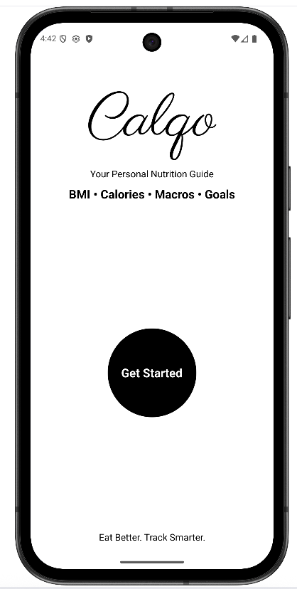
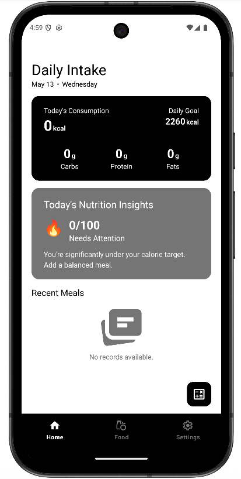
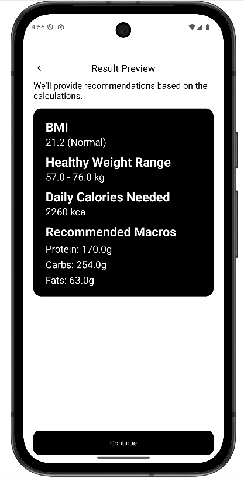

# Calorie Calculator - Personalized Nutrition Tracker

An intelligent **offline Android calorie tracking app** with personalized macronutrient recommendations. Built for BCA Final Year Project.

## Features

- **Personalized Nutrition Engine** – Calculates BMI, BMR, TDEE, and goal-based daily calories & macros
- **Smart Nutrition Insights** – Analyzes your daily intake and gives actionable recommendations
- **Powerful Food Search** – Search by name with category & dietary (Veg/Non-Veg) filters
- **Flexible Serving Sizes** – Adjust portions with 0.5 increments
- **Meal History** – Track daily meals with detailed snapshots
- **Offline First** – Fully functional without internet
- **CSV Import/Export** – Easy backup and restore of food database
- **Modern Material Design 3** UI with dark theme support

## Intelligent Algorithm

The app features a **Personalized Macronutrient Recommendation Algorithm** that uses:

- Mifflin-St Jeor Equation (BMR)
- Activity Level Multipliers (Sedentary to Extra Active)
- Goal-based adjustments (Weight Loss / Maintenance / Weight Gain)
- Dynamic macro distribution (Protein, Carbs, Fats)
- Weighted Nutrition Balance Scoring & Insights

## Screenshots






## Tech Stack

- **Language**: Java
- **Architecture**: Fragment-based MV (Model-View)
- **UI**: Material Design 3 + ConstraintLayout
- **Database**: SQLite (with CSV support)
- **State Management**: SharedPreferences + Fragment Result API

## Installation

1. Clone the repository:
   ```bash
   git clone https://github.com/yourusername/calorie-calculator-android.git
   ```
2. Open the project in Android Studio
3. Sync Gradle and run on emulator/device (Minimum SDK: 21)

## How to Use

- Onboarding → Set up your profile (Age, Weight, Height, Gender, Activity Level, Goal)
- Get Personalized Targets → View your recommended daily calories and macros
- Log Meals → Search & add foods with custom serving sizes
- Track Progress → Monitor daily intake vs goals with smart insights

## Project Highlights

- Fully implements Personalized Macronutrient Recommendation Algorithm
- Real-time nutrition analysis and recommendations
- Clean, maintainable code structure
- Well-documented for academic submission

## Report & Documentation

- Full Project Report (BCA Final Year) included in /docs folder
- Test Cases, Screenshots, UML Diagrams, and Algorithm Details available

### Author
- Saurav Tamrakar
- GitHub: [Saurav-T](https://github.com/Saurav-T)